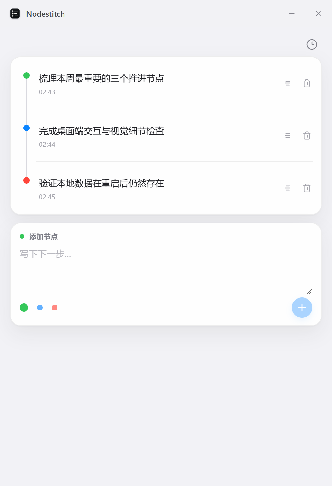
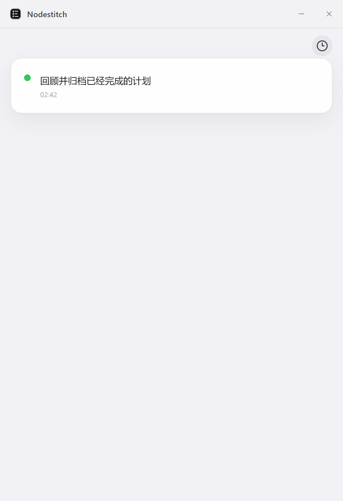

<p align="center">
  
</p>

<h1 align="center">Nodestitch</h1>

<p align="center">
  一款纯本地、轻量克制的 Windows 桌面时间线任务规划工具。
</p>

<p align="center">
  <a href="https://github.com/wp-i/nodestitch/actions/workflows/ci.yml"></a>
  
  
  <a href="LICENSE"></a>
</p>

## 亮点

- **一条持续生长的时间线**：所有计划都沿同一条轴线排列，不引入看板、层级或复杂配置。
- **快速整理节点**：添加文字、双击编辑、拖动排序和归档删除都在主界面完成。
- **三种自由定义的颜色**：绿色、蓝色和红色只负责视觉分类，不预设优先级或状态含义。
- **不可编辑的创建时间**：节点创建后自动记录日期与时间，编辑、换色和排序不会改变它。
- **删除但不遗忘**：删除会把完整节点移入只读历史，再次点击时钟按钮即可回到时间线。
- **纯本地、无账号**：节点、顺序和历史保存在本机 SQLite，不需要登录，不提供云同步，也不加入遥测。
- **克制的桌面体验**：以适合小窗口的类 iOS 视觉语言呈现，控制文本尽量精简，并为新增、归档和排序提供短促平滑的动画。
- **完整的 Windows 入口**：支持 NSIS 安装包、开始菜单和桌面快捷方式，普通启动不会显示控制台窗口。

## 界面预览

| 主时间线 | 历史节点 |
| --- | --- |
|  |  |

## 使用方式

1. 在底部输入下一步计划，可选择绿色、蓝色或红色圆点，然后点击加号添加节点。
2. 双击节点文字进入原位编辑，按 `Enter` 保存，按 `Esc` 取消，按 `Shift + Enter` 换行。
3. 拖动节点右侧把手调整顺序；聚焦把手后也可使用 `Alt + ↑/↓` 排序。
4. 点击节点圆点可依次切换三种颜色，颜色含义完全由使用者决定。
5. 点击垃圾桶按钮把节点移入只读历史；点击右上角时钟按钮查看历史，再次点击返回时间线。
6. 创建时间只用于展示：当天节点显示时分，较早节点显示月日与时分。

## Windows 兼容性

| 环境 | 当前验证状态 |
| --- | --- |
| Windows 10 x64 | 已完成原生窗口、缩放、滚动、交互、持久化、安装包、桌面快捷方式和无控制台冷启动验证 |
| Windows 11 x64 | 尚未完成完整验收，不作正式兼容性声明 |
| Windows 11 ARM64 | 暂无原生安装包，也未完成验证 |

当前验证环境为 Windows 10 22H2（内部版本 19045），显示缩放为 200%。安装包尚未购买代码签名证书，Windows 可能显示来源提示；正式发布后请只从本仓库发布页下载安装包。

## 技术栈

- Tauri 2 / Rust：Windows 窗口行为、SQLite 边界与原生安装包
- React 19 / TypeScript / Vite：界面与交互
- SQLite / rusqlite：本地持久化的唯一数据源

窗口控制、领域状态和持久化分别维护边界。React 组件只消费已经提交的快照并发送操作命令，不作为第二份数据源。

## 本地开发

需要 Node.js、npm、Rust 稳定版、Microsoft C++ 生成工具和 WebView2。

```powershell
npm install
npm run tauri dev
```

常用检查：

```powershell
npm test
npm run build
cargo test --manifest-path src-tauri/Cargo.toml
cargo clippy --manifest-path src-tauri/Cargo.toml --all-targets -- -D warnings
```

构建 Windows NSIS 安装包：

```powershell
npm run tauri build
```

安装包生成在 `src-tauri/target/release/bundle/nsis/`。默认窗口尺寸为 `520 × 760` 个逻辑像素，最小可缩放到 `320 × 500`。

生产环境的状态所有者是 `TimelineController`。Rust 边界会校验时间线文档，并通过事务把一个带版本的数据快照原子写入 SQLite；写入失败时，不会发布与磁盘不一致的内存状态。

## 隐私

Nodestitch 不需要注册账号，也不会主动联网同步计划。应用数据保存在 Tauri 为 `app.nodestitch.desktop` 分配的本地应用数据目录中。WebView2 缺失时，Windows 安装流程可能需要联网获取运行环境。

## 参与贡献

欢迎提交缺陷、Windows 真实环境验证记录和聚焦于现有产品边界的改进。开始前请阅读 [贡献指南](CONTRIBUTING.md) 和 [安全政策](SECURITY.md)。涉及窗口、焦点、拖动、缩放或动画的修改，请附真实 Windows 截图或录屏。

所有修改都必须遵循 [项目规则](AGENTS.md) 与 [交付记录](PROJECT_HANDOFF.md) 中已经确认的产品边界。

## 许可证与第三方说明

源代码和仓库内原创视觉资产以 [MIT 许可证](LICENSE) 发布。直接依赖、参考实现与相应许可证见 [第三方说明](THIRD_PARTY_NOTICES.md)。
